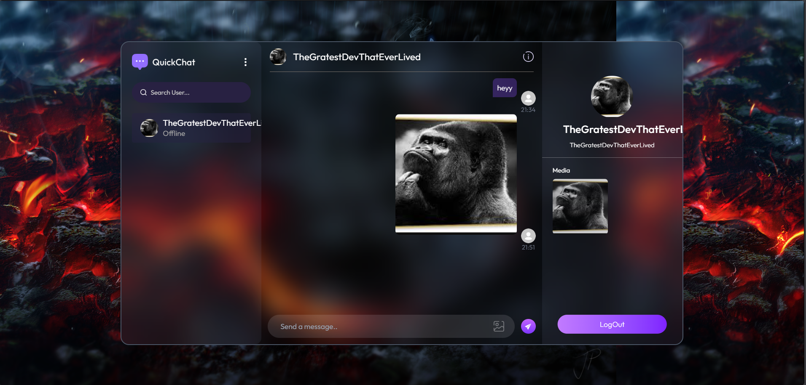
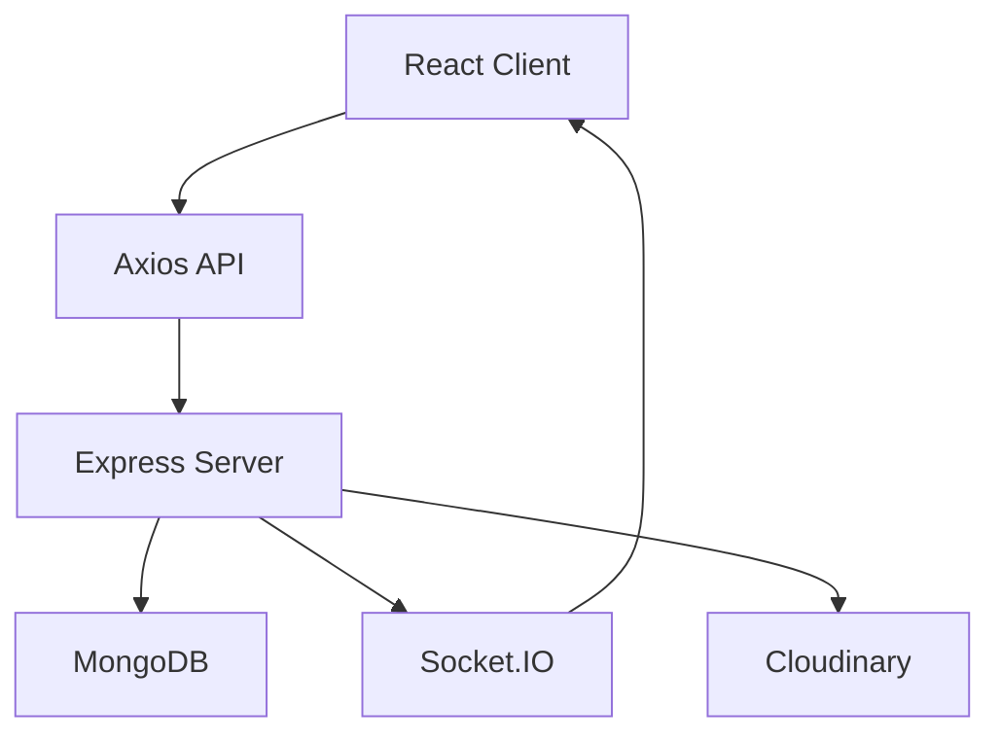
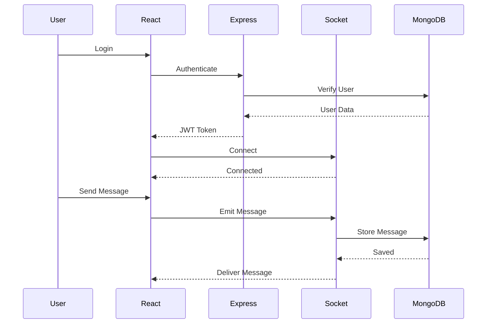
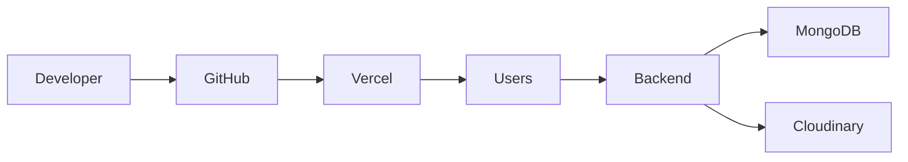
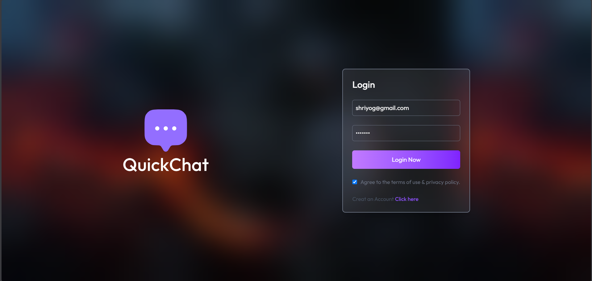
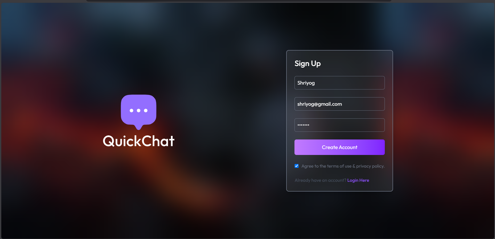
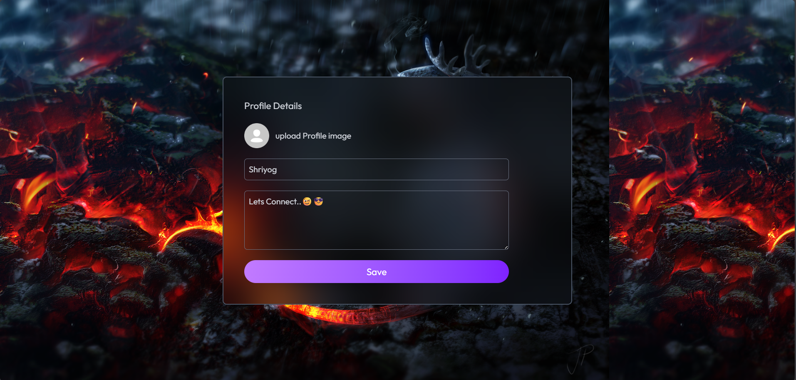

<div align="center">

# 💬 QuickChat

### Modern Full-Stack Real-Time Chat Application


<p>

<a href="https://quick-chat-app-fawn.vercel.app/login">

</a>

<a href="https://github.com/SHRIYOG-PUNDE/Quick-Chat-App">

</a>

<a href="https://port-folio-updated.vercel.app/">

</a>

</p>

<p>


</p>

---

### ⚡ Built With

<p>


</p>

---

### ⭐ If you like this project, don't forget to leave a star!

</div>

---

# 📸 Preview

<p align="center">



</p>

---

# 📖 Table of Contents

- [Overview](#-overview)
- [Why QuickChat?](#-why-quickchat)
- [Features](#-features)
- [Tech Stack](#-tech-stack)
- [System Architecture](#-system-architecture)
- [Project Structure](#-project-structure)

---

# 🚀 Overview

QuickChat is a modern **full-stack real-time messaging platform** built using the **MERN Stack**. The application enables users to communicate instantly through WebSockets while maintaining secure authentication, scalable architecture, and a responsive user experience.

Designed with production-ready development practices, QuickChat demonstrates modern frontend engineering, REST API design, JWT authentication, cloud-based media storage, and real-time communication using Socket.IO.

Whether you're chatting one-on-one, sharing images, or viewing online users, QuickChat delivers a fast, reliable, and intuitive messaging experience.

---

# 💡 Why QuickChat?

Unlike traditional CRUD projects, QuickChat demonstrates concepts commonly used in modern production systems.

### It showcases:

- 🔐 Secure JWT Authentication
- ⚡ Real-Time Communication
- 🌐 REST API Integration
- ☁️ Cloud Image Storage
- 📱 Fully Responsive Interface
- 🟢 Online Presence Detection
- 🗂 Modular Backend Architecture
- 🚀 Production Deployment

---

# ✨ Features

<table>

<tr>

<td width="50%">

### 🔐 Authentication

- Secure Registration
- Login System
- JWT Authentication
- Password Hashing
- Protected Routes

</td>

<td width="50%">

### 💬 Chat

- Real-Time Messaging
- Instant Delivery
- Online Users
- Chat History
- Fast Synchronization

</td>

</tr>

<tr>

<td>

### ☁️ Media

- Cloudinary Integration
- Image Upload
- Image Preview
- Optimized Storage

</td>

<td>

### 🎨 UI

- Responsive Design
- Modern Layout
- Clean Components
- Toast Notifications

</td>

</tr>

</table>

---

# 🛠 Tech Stack

<table>

<tr>

<th>Category</th>
<th>Technologies</th>

</tr>

<tr>

<td><b>Frontend</b></td>

<td>

React • Vite • Tailwind CSS • Axios

</td>

</tr>

<tr>

<td><b>Backend</b></td>

<td>

Node.js • Express.js

</td>

</tr>

<tr>

<td><b>Database</b></td>

<td>

MongoDB • Mongoose

</td>

</tr>

<tr>

<td><b>Authentication</b></td>

<td>

JWT • bcrypt

</td>

</tr>

<tr>

<td><b>Realtime</b></td>

<td>

Socket.IO

</td>

</tr>

<tr>

<td><b>Cloud Services</b></td>

<td>

Cloudinary

</td>

</tr>

<tr>

<td><b>Deployment</b></td>

<td>

Vercel • Render / Node Server

</td>

</tr>

</table>

---

# 🏗 System Architecture



---

# 🔄 Application Workflow



---

# 📂 Project Structure

```text

Quick-Chat-App

│

├── client

│ ├── public

│ ├── src

│ │

│ ├── assets

│ ├── components

│ ├── context

│ ├── hooks

│ ├── pages

│ ├── services

│ ├── utils

│ └── App.jsx

│

├── server

│ ├── config

│ ├── controllers

│ ├── middleware

│ ├── models

│ ├── routes

│ ├── socket

│ ├── utils

│ └── server.js

│

├── README.md

└── package.json

```

---

# 📊 Project Highlights

| Feature | Status |
|----------|--------|
| JWT Authentication | ✅ |
| Secure Password Hashing | ✅ |
| MongoDB Integration | ✅ |
| Socket.IO Messaging | ✅ |
| Image Upload | ✅ |
| Responsive UI | ✅ |
| Cloudinary Storage | ✅ |
| REST API | ✅ |
| Production Deployment | ✅ |
| Mobile Friendly | ✅ |

---

<div align="center">

## 🚀 Modern • Secure • Fast • Scalable

**Built with ❤️ by Shriyog Punde**

</div>
---

# ⚙️ Installation

## Prerequisites

Before running this project, ensure you have the following installed:

| Software | Version |
|----------|---------|
| Node.js | 18+ |
| npm | Latest |
| MongoDB | Atlas / Local |
| Git | Latest |

---

## Clone the Repository

```bash
git clone https://github.com/SHRIYOG-PUNDE/Quick-Chat-App.git

cd Quick-Chat-App
```

---

## Install Frontend Dependencies

```bash
cd client

npm install
```

---

## Install Backend Dependencies

```bash
cd ../server

npm install
```

---

# 🔑 Environment Variables

Create a `.env` file inside the **server** folder.

```env

PORT=5000

MONGODB_URI=your_mongodb_connection

JWT_SECRET=your_secret_key

CLOUDINARY_CLOUD_NAME=xxxxxxxx

CLOUDINARY_API_KEY=xxxxxxxx

CLOUDINARY_API_SECRET=xxxxxxxx

NODE_ENV=development

```

> Never commit your `.env` file to GitHub.

---

# ▶️ Running the Application

### Start Backend

```bash
cd server

npm run server
```

Backend runs on

```
http://localhost:5000
```

---

### Start Frontend

```bash
cd client

npm run dev
```

Frontend runs on

```
http://localhost:5173
```

---

# 🚀 Deployment

QuickChat is deployed using **Vercel** for the frontend.

## Live Application

> https://quick-chat-app-fawn.vercel.app/login

---

## Deployment Architecture



---

## Frontend Deployment

- Vercel

- Automatic CI/CD

- HTTPS Enabled

- Optimized Static Hosting

---

## Backend Deployment

Compatible with

- Render

- Railway

- VPS

- Digital Ocean

- AWS EC2

---

# 📸 Application Screenshots

> Save screenshots inside

```

assets/

```

Recommended filenames

```

login.png

register.png

chatWindow.png

profile.png


```

---

## Login Page

<p align="center">



</p>

---

## Registration

<p align="center">



</p>

---

## Chat Window

<p align="center">


</p>

---

## Profile

<p align="center">



</p>

---

# 🔌 API Overview

## Authentication

| Method | Endpoint | Description |
|---------|----------|-------------|
| POST | `/api/auth/register` | Register User |
| POST | `/api/auth/login` | Login User |
| GET | `/api/auth/profile` | User Profile |

---

## Messages

| Method | Endpoint | Description |
|---------|----------|-------------|
| GET | `/api/messages/:id` | Get Chat History |
| POST | `/api/messages/send/:id` | Send Message |

---

## Users

| Method | Endpoint | Description |
|---------|----------|-------------|
| GET | `/api/users` | Get All Users |
| GET | `/api/users/:id` | User Details |

---

# 🔄 Socket.IO Events

## Client → Server

```

sendMessage

typing

joinRoom

disconnect

```

---

## Server → Client

```

receiveMessage

onlineUsers

typingStatus

disconnect

```

---

# 🔒 Security Features

QuickChat follows several best practices to ensure user security.

### Authentication

- JWT Authentication

- Protected Routes

- Token Verification

---

### Password Security

- bcrypt Password Hashing

- Secure Login Flow

- Hidden Password Storage

---

### API Security

- Environment Variables

- Input Validation

- Error Handling

- Secure REST Endpoints

---

### Cloud Security

- Cloudinary Secure Uploads

- Image URL Protection

---

# ⚡ Performance Optimizations

QuickChat has been optimized for smooth user experience.

### Frontend

- React Component Reuse

- Lazy Rendering

- Axios Instance

- Optimized State Updates

- Responsive Layout

---

### Backend

- Modular Controllers

- Efficient MongoDB Queries

- Socket.IO Room Management

- Middleware Architecture

---

### Database

- Indexed User Lookup

- Optimized Message Storage

- Efficient Schema Design

---

# 📈 Project Statistics

| Metric | Value |
|---------|------|
| Frontend | React + Vite |
| Backend | Express.js |
| Database | MongoDB |
| Authentication | JWT |
| Realtime | Socket.IO |
| Media Storage | Cloudinary |
| Deployment | Vercel |

---

# 🧪 Testing (Future Scope)

The following testing strategies are planned:

- Unit Testing

- Integration Testing

- API Testing

- Socket Event Testing

- End-to-End Testing

Recommended tools

- Jest

- Supertest

- Cypress

- Postman

---

# 📚 Developer Notes

This project demonstrates:

- Full Stack Development

- REST API Design

- Real-Time WebSocket Communication

- Authentication & Authorization

- Cloud Media Management

- Responsive UI Development

- Modern MERN Architecture

- Production Deployment

---
---

# 🎯 Why I Built QuickChat

As I progressed through my journey in Full Stack Development, I wanted to build more than just a CRUD application. My goal was to create a project that demonstrates the technologies and software engineering concepts commonly used in modern production environments.

QuickChat was built to strengthen my understanding of:

- Designing scalable MERN applications
- Real-time communication using WebSockets
- Secure authentication with JWT
- RESTful API development
- Cloud-based media storage
- Responsive frontend development
- Production deployment workflows

This project challenged me to think beyond writing code and focus on building a complete, user-friendly application with clean architecture and maintainable code.

---

# 💼 Recruiter Highlights

QuickChat demonstrates practical experience in:

| Skill | Demonstrated |
|--------|--------------|
| Full Stack Development | ✅ |
| REST API Development | ✅ |
| Authentication & Authorization | ✅ |
| Database Design | ✅ |
| WebSocket Communication | ✅ |
| Cloud Integration | ✅ |
| State Management | ✅ |
| Responsive Design | ✅ |
| Version Control (Git) | ✅ |
| Production Deployment | ✅ |

---

# 🧠 Engineering Challenges & Solutions

## 🔐 Authentication

### Challenge

Maintaining secure user sessions while protecting private routes.

### Solution

Implemented JWT-based authentication with protected API routes and secure password hashing using bcrypt.

---

## ⚡ Real-Time Messaging

### Challenge

Synchronizing messages instantly between multiple connected users.

### Solution

Integrated Socket.IO for bidirectional communication, enabling instant message delivery and live online status updates.

---

## ☁️ Image Upload

### Challenge

Efficiently storing and serving user-uploaded images without increasing server storage requirements.

### Solution

Integrated Cloudinary to securely upload, optimize, and deliver media assets.

---

## 📱 Responsive Design

### Challenge

Creating a consistent experience across desktops, tablets, and mobile devices.

### Solution

Built the interface with Tailwind CSS using responsive layouts and reusable UI components.

---

# 📚 What I Learned

Developing QuickChat helped me strengthen my understanding of:

- Building production-style MERN applications
- Structuring scalable backend architectures
- Managing application state effectively
- Designing REST APIs
- Working with MongoDB and Mongoose
- Handling asynchronous programming
- Integrating third-party cloud services
- Implementing secure authentication
- Deploying full-stack applications
- Using Git and GitHub for version control

---

# 📈 Project Roadmap

## Completed

- [x] User Registration
- [x] User Login
- [x] JWT Authentication
- [x] Protected Routes
- [x] Password Hashing
- [x] Real-Time Messaging
- [x] Online User Status
- [x] Cloudinary Integration
- [x] Responsive Design
- [x] MongoDB Integration
- [x] REST API
- [x] Production Deployment

---

## Planned Features

- [ ] Group Chats
- [ ] Voice Calling
- [ ] Video Calling
- [ ] Emoji Reactions
- [ ] Read Receipts
- [ ] Push Notifications
- [ ] Message Search
- [ ] Dark Mode
- [ ] User Blocking
- [ ] Friend Requests
- [ ] Typing Indicators
- [ ] Message Editing
- [ ] File Sharing
- [ ] Admin Dashboard
- [ ] Progressive Web App (PWA)

---

# 📊 Project Timeline

```text
Planning               ██████████ 100%

Frontend               ██████████ 100%

Backend                ██████████ 100%

Authentication         ██████████ 100%

Socket.IO              ██████████ 100%

Cloudinary             ██████████ 100%

Deployment             ██████████ 100%

Future Features        ███░░░░░░░ 30%
```

---

# 🤝 Contributing

Contributions are always welcome!

### Steps

1. Fork the repository

2. Create your feature branch

```bash
git checkout -b feature/AmazingFeature
```

3. Commit your changes

```bash
git commit -m "Add AmazingFeature"
```

4. Push to GitHub

```bash
git push origin feature/AmazingFeature
```

5. Open a Pull Request

---

# 📝 License

This project is licensed under the **MIT License**.

Feel free to use, modify, and distribute this project for educational and personal purposes.

---

# 🙏 Acknowledgements

Special thanks to the amazing open-source community and the technologies that made this project possible.

- React
- Node.js
- Express.js
- MongoDB
- Socket.IO
- Tailwind CSS
- Cloudinary
- Vercel

---

# 👨‍💻 About the Developer

## Shriyog Punde

Computer Engineering Undergraduate passionate about building modern web applications using the MERN Stack.

### Interests

- Full Stack Development
- Backend Engineering
- Cloud Technologies
- Software Architecture
- Open Source
- UI/UX Design

---

# 🌐 Connect With Me

### Portfolio

https://port-folio-updated.vercel.app/

### GitHub

https://github.com/SHRIYOG-PUNDE

### Project Repository

https://github.com/SHRIYOG-PUNDE/Quick-Chat-App

### Live Demo

https://quick-chat-app-fawn.vercel.app/login

---

# ⭐ Support

If you found this project helpful, please consider giving it a ⭐ on GitHub.

It helps increase the visibility of the project and motivates me to build more open-source applications.

---

# 💡 Future Goals

My objective is to continuously improve QuickChat by adding features commonly found in production messaging platforms while maintaining clean architecture, scalability, and a great user experience.

Future versions will focus on:

- Enterprise-grade architecture
- Improved scalability
- Advanced security
- Better performance
- AI-powered features
- Enhanced user experience

---

<div align="center">

## 🚀 Thanks for Visiting!

### If you enjoyed this project...

⭐ Star the repository

🍴 Fork it

🛠️ Contribute

📢 Share it with others

---


### Made with ❤️ by **Shriyog Punde**

**Building modern web experiences, one project at a time.**

</div>
